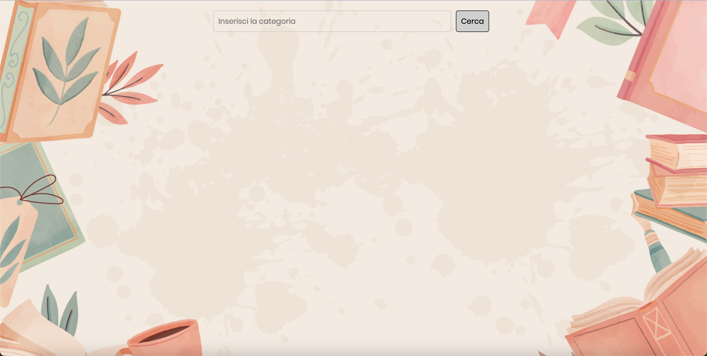

# education
Applicazione con l’obiettivo di incentivare la lettura dei libri attraverso il servizio esterno Open Library.

---

### Descrizione Applicazione

Quest'app è stata creata per incentivare la lettura di libri. Attraverso la barra di ricerca, se si scrive "Fantasy" il risultato sarà una lista di libri del genere Fantasy inseriti nel servizio esterno Open Library.

---

### Tecnologie Utilizzate

HTML, CSS, JavaScipt.

---

 
La funzionalità generale del progetto è che è abbastanza intuitivo e non ha bisogno di essere aperto in una nuova finestra.
Questa pagina è stata progettata per avere poche informazioni ma solo l'applicazione, per evitare il disordine come principio di progettazione.

---

## Licenze

Licenza per pubblico utilizzo e il progetto può essere copiato.

---

### Licenza MIT

Con la presente si concede il permesso, a titolo gratuito, a chiunque ottenga una copia di questo software e dei file di documentazione associati (il "Software"), di trattare il Software senza alcuna restrizione, compresi, senza limitazione, i diritti di utilizzare, copiare, modificare, unire, pubblicare, distribuire, concedere in sublicenza e/o vendere copie del Software, e di permettere alle persone a cui il Software viene fornito di farlo.

---

## Autore 

Website: https://github.com/valetm-92/education

---

## Contatti

email: valentinamanfredi92@gmail.com

